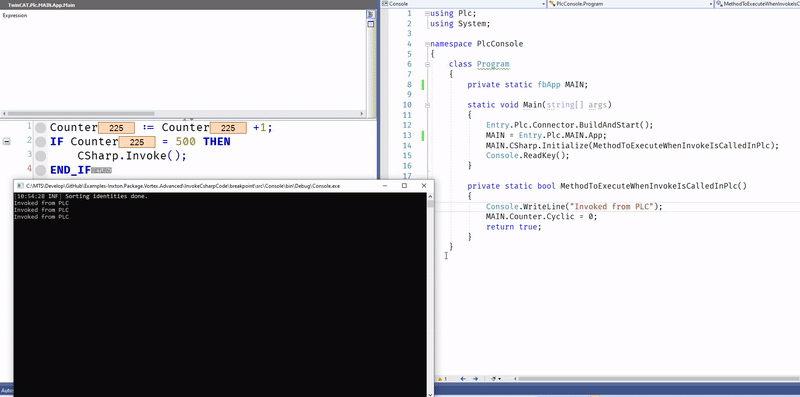
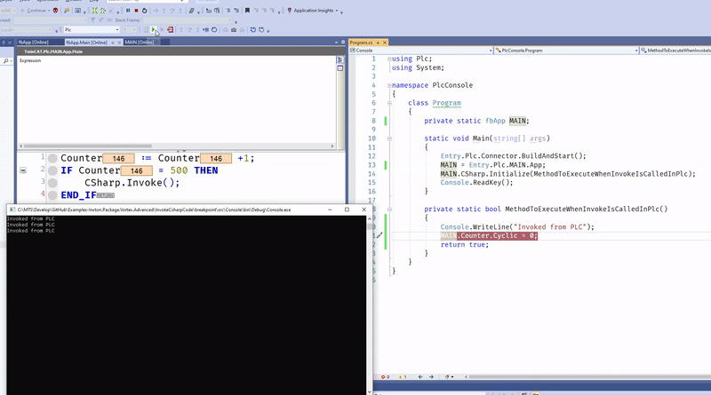
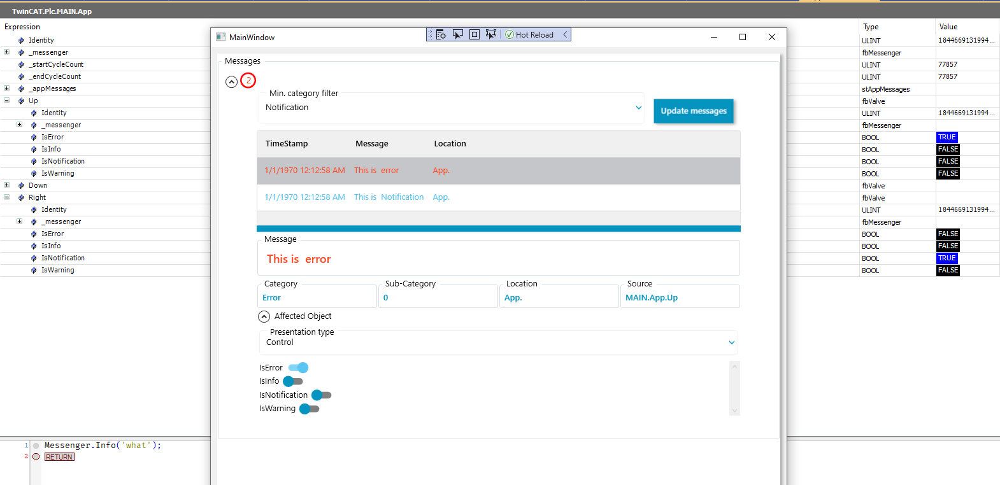
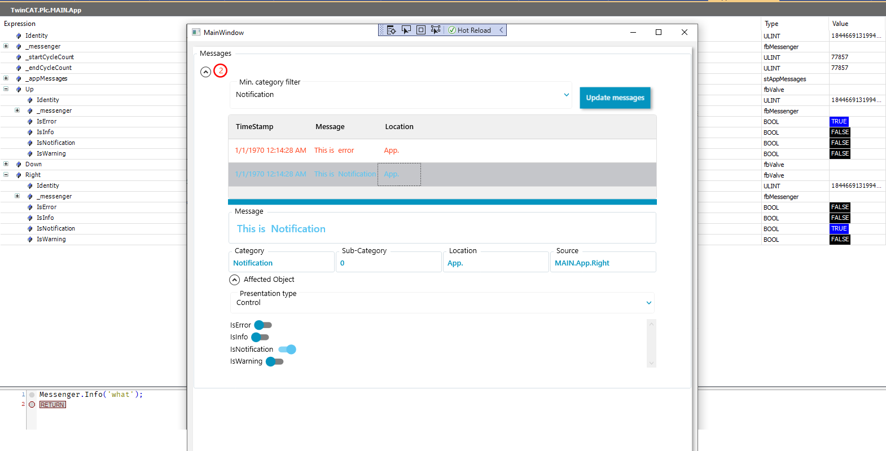
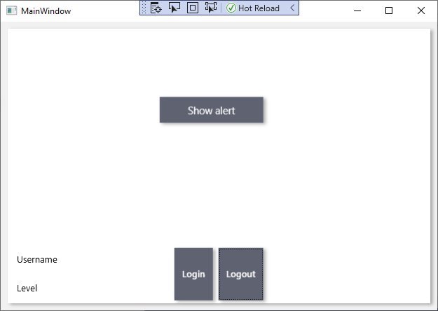
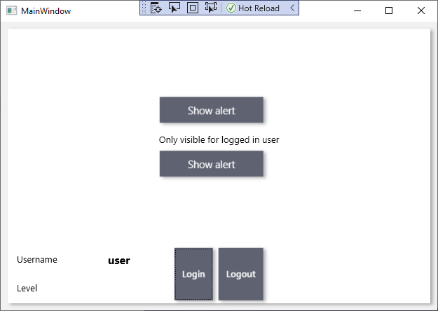
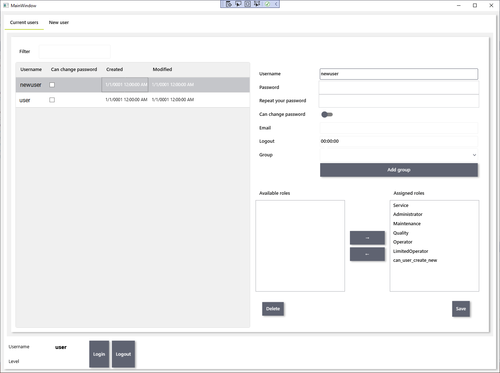
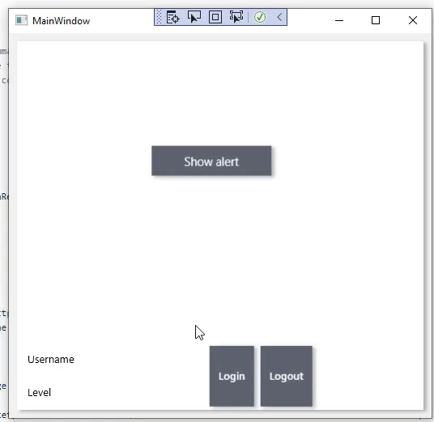

# THIS IS PRELIMINARY DOCUMENTATION. Inxton.Package.Vortex.Advanced release pending.


# Inxton.Package.Vortex.Advanced

*Inxton.Package.Vortex.Advanced* extends [Inxton.Package.Vortex.Essentials](/Inxton.Package.Vortex.Essentials/README.md) with libraries for **PLC to .NET RPC, User Management, Diagnostics and Security.** .

[What is Remote Procedure Call (RPC)](https://searchapparchitecture.techtarget.com/definition/Remote-Procedure-Call-RPC)

This project is part of Inxton.Vortex.Framework. 


## What's inside *Inxton.Package.Vortex.Advanced* package

- **[Inxton.Vortex.Base](/apis/Inxton.Vortex.Base.Wpf/API/README.md)** - Base for PLC App, Components, Diagnostics, Messaging, Commands and Security
- **[Inxton.Vortex.Base.Wpf](/apis/Inxton.Vortex.Base.Wpf/README.md)** - Visual components for components mentioned above
- **[Inxton.Vortex.Security](/apis/Inxton.Vortex.Security/README.md)** - User management, roles - enable/disable parts of your app for specific users.
- **[Inxton.Vortex.Security.Wpf](/apis/Inxton.Vortex.Security.Wpf/README.md)**- Visual components for components mentioned above

# Getting started

## Check the prerequisites

Make sure you have everything you need to start using examples in this repository [here](https://github.com/Inxton/documentation/blob/master/PREREQUISITES.MD).

If you are not familiar with INXTON, make sure you understand the basics [Inxton.Package.Vortex.Core](https://github.com/Inxton/Examples-Inxton.Package.Vortex.Core/).

## Setup PLC
Create a function block which will extend from `VortexBase.fbVortexApp`. This will be the root of the application.
```
FUNCTION_BLOCK fbApp EXTENDS VortexBase.fbVortexApp 
```
It has to override method `Main`. This method is the cyclic root of the code.
`METHOD PROTECTED Main`

In your `PROGRAM` create an instance of the function block and run it with the AMS ID of your PLC.
```PASCAL
PROGRAM MAIN
VAR
	App :fbApp;
END_VAR
---
App.Run('10.10.10.1.1.1'); // AMS ID of the system wich provides time synchronization, when local system serves the purprose use empty string App.Run('')
```

## Required NuGet packages

Make sure you install the following NuGet packages.

For TwinConnector project:

https://www.nuget.org/packages/Inxton.Package.Vortex.Advanced/
~~~ bash
Install-Package Inxton.Package.Vortex.Advanced
~~~

For your WPF application:

https://www.nuget.org/packages/Inxton.Package.Vortex.Advanced.Wpf/
~~~ bash
Install-Package Inxton.Package.Vortex.Advanced.Wpf
~~~

## Installing the license

Get your free developer license [here](/common/LicenseInstallation.md).

## How to invoke C# code from PLC

In your PLC project create an instance of `fbRemoteExec`
```pascal
FUNCTION_BLOCK fbApp EXTENDS VortexBase.fbVortexApp 
VAR
	CSharp : VortexBase.fbRemoteExec;
	Counter : INT;
END_VAR 
-------
Counter := Counter +1;
IF Counter > 100 THEN
  CSharp.Invoke();
END_IF
```
Run the Inxton builder.
In your C# Code
```csharp
private static fbApp MAIN;

static void Main(string[] args)
{
    Entry.Plc.Connector.BuildAndStart();
    MAIN = Entry.Plc.MAIN.App;
    MAIN.CSharp.Initialize(MethodToExecuteWhenInvokeIsCalledInPlc);
    Console.ReadKey();
}

private static bool MethodToExecuteWhenInvokeIsCalledInPlc()
{
    Console.WriteLine("Invoked from PLC");
    MAIN.Counter.Cyclic = 0;
    return true;
}
}
```
### Results



#### Breakpoint work too!



## How to use diagnostics tools

First of all setup this in your C# code you have to enable diagnostics
```csharp
MAIN.App.SetUp.WithMessaging();
```

To use messenger to its full potential it's recommended to extend from `VortexBase.fbVortexer`. This way you get full traceability of the system. 

All you have to do is to use `Messenger.Post` method or a helper method like `Messenger.Error` which will post an error without specifying a category. 

```pascal
FUNCTION_BLOCK fbValve EXTENDS VortexBase.fbVortexer
VAR
	IsError:BOOL;
	IsInfo:BOOL;
	IsNotification:BOOL;
	IsWarning:BOOL;
END_VAR
---
IF IsError THEN
	Messenger.Post('This is  error',enumMessageCategory.Error);
END_IF

IF IsInfo THEN
	Messenger.Post('This is  Info',enumMessageCategory.Info);
END_IF

IF IsNotification THEN
	Messenger.Post('This is  Notification',enumMessageCategory.Notification);
END_IF

IF IsWarning THEN
	Messenger.Post('This is  Warning',enumMessageCategory.Warning);
END_IF
```


To display the messages on your HMI use the well known 
```xaml
<vortex:RenderableContentControl DataContext="{Binding MAIN.App._appMessages}" />
```

### Result
When you click on the message you can see the **source** of the message. In this case, we have an error from the *Up valve* and an info message from the *Right valve*.

After you select another message you can see that the source of the message updates as well. You can also immediately use the auto-generated UI of the component. If you created your view for the structure it will display accordingly. 


## How to protect your app from unauthorized user
### How to implement login/logout

- You need to implement `IRepository<UserData>` to work with your user data. [example implementaion](https://github.com/Inxton/template.advanced/blob/master/src/WpfApp/UserFileRepository.cs)

- Create a SecurityManager with the user repostory [like we did in this example](https://github.com/Inxton/template.advanced/blob/3d9d7b7cd7f623b2ac93a3250d0e6efdc8b76df6/src/WpfApp/MainWindowModel.cs#L18)

- Login using the code `SecurityManager.Manager.Service.AuthenticateUser("user", "pass");` or via user interface.

- Wrap the user control  in ` <vortex:PermissionBox Permissions="specify|permission|that|can|see|this|box">` like we [did here](https://github.com/Inxton/template.advanced/blob/3d9d7b7cd7f623b2ac93a3250d0e6efdc8b76df6/src/WpfApp/MainWindow.xaml#L25)

### Result
#### Logged out

#### Logged in


## How to add users and roles

You can either use the code API in `Vortex.Framework.Security.SecurityManager` or user interface.
Create  `<vortex:UserManagementView></vortex:UserManagementView>`  in XAML after you create SecurityManager.
### Result



## How to use command to invoke an action

In object-oriented programming, the command pattern is a behavioral design pattern in which an object is used to encapsulate all information needed to perform an action or trigger an event at a later time. [wiki](https://en.wikipedia.org/wiki/Command_pattern)

Let's use a command to invoke some C# code.  

```
FUNCTION_BLOCK fbApp EXTENDS VortexBase.fbVortexApp
VAR
	{attribute addProperty Name "Show alert"}
	RunRemoteExec : VortexBase.fbCommand;
	AlertDialog : VortexBase.fbRemoteExec;
END_VAR
--- METHOD PROTECTED Main
IF RunRemoteExec.Monitor() THEN               // monitor if the command has been invoked
	IF AlertDialog.Invoke() THEN          // if so, execute the task
		RunRemoteExec.Complete();     // after the task is completed, mark the command as completed.
	END_IF
END_IF
```

In C# XAML code 

```xml
<vortex:RenderableContentControl DataContext="{Binding MAIN.App.RunRemoteExec}" />
```

### Result


## New project template

When you are already familiar with the framework you can [clone](https://github.com/Inxton/template.advanced.git) or [download](https://github.com/Inxton/template.advanced/archive/master.zip) the [template.advanced](https://github.com/Inxton/template.advanced) project.

## What to do next?

Checkout documentation  [Inxton.Package.Vortex.Core](/Inxton.Package.Vortex.Advanced/README.md).

Install the extension from [Visual Studio Marketplace](https://marketplace.visualstudio.com/items?itemName=Inxton.InxtonVortexBuilderExtensionPre).

# Need help?

🧪 Create an issue [here](https://github.com/Inxton/Feedback/issues/new/choose)

📫 We use mail too team@inxton.com 

🐤 Contact us on Twitter [@Inxton](https://twitter.com/inxtonteam)

📽 Check out our [YouTube](https://www.youtube.com/channel/UCB3EcnWyLSsV5gqSt8PRDXA/featured)

🌐 For more info check out our website [INXTON.com](https://www.inxton.com/)


# Contributing

We are more than happy to hear your feedback, ideas!
Just submit it [here](https://github.com/Inxton/Feedback/issues/new/choose)  

---
Developed with ♥ at [MTS](https://www.mts.sk/en) - putting the heart into manufacturing.
