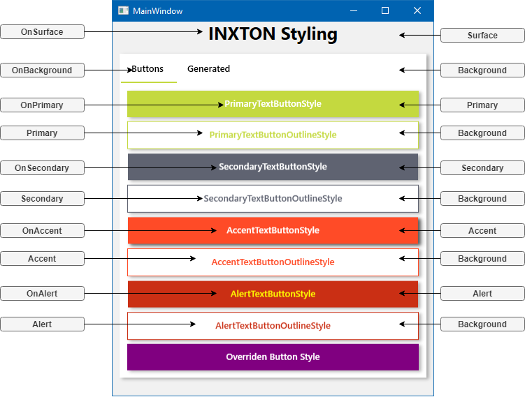
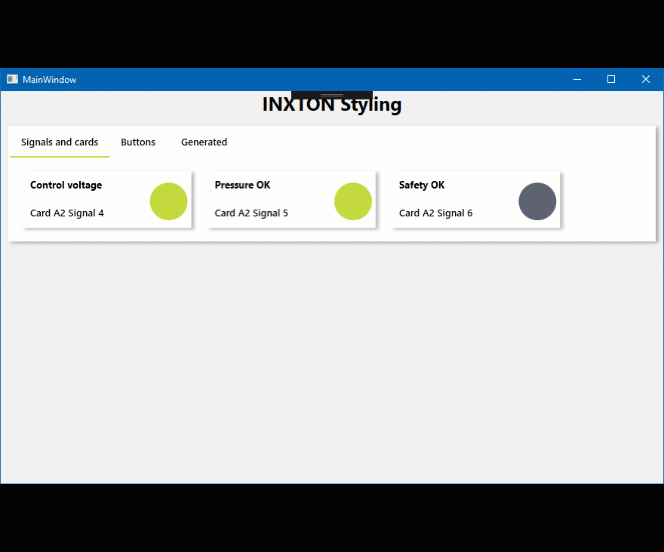

# Inxton.Package.Vortex.Styling.Wpf

Material design inspired styling for INXTON - Create visually appealing industrial applications without any effort.

### How to apply styles

Add this resources to `App.xaml`.

~~~xml
<Application.Resources>
    <ResourceDictionary>
        <ResourceDictionary.MergedDictionaries>
            <ResourceDictionary Source="pack://application:,,,/Vortex.Presentation.Styling.Wpf;component/VortexStyle.xaml" />
        </ResourceDictionary.MergedDictionaries>
    </ResourceDictionary>
</Application.Resources>
~~~

#### Result

## Color system

Inxton is inspired by color system by [Material design](https://www.material.io/design/color/the-color-system.html#color-theme-creation)

| Color             | Default color | Wpf SolidColorBrush |
| -------------     | -----         |-----                |
| PrimaryColor      | #C4D93F       |Primary              |
| SecondaryColor    | #5F6371       |Secondary            |
| BackgroundColor   | #FFFFFF       |Background           |
| SurfaceColor      | #F1F1F1       |Surface              |
| ErrorColor        | #FF4B27       |Error                |
| AccentColor       | #FF4B27       |Accent               |
| AlertColor        | #CA2F14       |Alert                |
| WarningColor      | #FF4B27       |Warning              |
| SignalOffColor    | #5F6371       |SignalOff            |
| SignalOnColor     | #C4D93F       |SingalOn             |
| IntermediateColor | #TODO         |Intermediate         |

For every `Color` there is an `OnColor` - Used mainly for text color. 

| Color               | Default color | Wpf SolidColorBrush |
| -------------       | -----:        |-----                |
| OnPrimaryColor      | #FFFFFF       |OnPrimary            |
| OnSecondaryColor    | #FFFFFF       |OnSecondary          |
| OnBackgroundColor   | #000000       |OnBackground         |
| OnSurfaceColor      | #000000       |OnSurface            |
| OnErrorColor        | #FFFFFF       |OnError              |
| OnAccentColor       | #FFFFFF       |OnAccent             |
| OnAlertColor        | #FFFF00       |OnAlert              |
| OnWarningColor      | #FFFFFF       |OnWarning            |
| OnSignalOffColor    | #FFFFFF       |OnSignalOff          |
| OnSignalOnColor     | #FFFFFF       |OnSingalOn           |
| OnIntermediateColor | #FFFFFF       |OnIntermediate       |

### How to override a color

In case you want to use your own colors just override them in your App.xaml like this
~~~XML
<Color x:Key="PrimaryColor">Purple</Color>
<SolidColorBrush x:Key="Primary" Color="{StaticResource PrimaryColor}" />
~~~

### Buttons

Read more about buttons and user experience (UX) [here](https://uxplanet.org/primary-secondary-action-buttons-c16df9b36150)       

#### Primary buttons
Contained buttons are high-emphasis, distinguished by their use of elevation and fill. They contain actions that are primary to your app. User is guided towards the primary button.

#### Secondary buttons
Secondary actions should have the weakest visual weight, because reducing the visual prominence of secondary actions minimizes the risk for potential errors and further directs people toward a successful outcome.

#### Outlined buttons
Outlined buttons are medium-emphasis buttons. They contain actions that are important, but aren’t the primary action in an app.

#### Alert buttons 
They represent irreversible action - Exit application, delete a record, dangerous action

#### Usage
~~~xml
<Button Content="PrimaryTextButtonStyle"          Style="{DynamicResource PrimaryTextButtonStyle}"          />
<Button Content="PrimaryTextButtonOutlineStyle"   Style="{DynamicResource PrimaryTextButtonOutlineStyle}"   />
<Button Content="SecondaryTextButtonStyle"        Style="{DynamicResource SecondaryTextButtonStyle}"        />
<Button Content="SecondaryTextButtonOutlineStyle" Style="{DynamicResource SecondaryTextButtonOutlineStyle}" />
<Button Content="AccentTextButtonStyle"           Style="{DynamicResource AccentTextButtonStyle}"           />
<Button Content="AccentTextButtonOutlineStyle"    Style="{DynamicResource AccentTextButtonOutlineStyle}"    />
<Button Content="AlertTextButtonStyle"            Style="{DynamicResource AlertTextButtonStyle}"            />
<Button Content="AlertTextButtonOutlineStyle"     Style="{DynamicResource AlertTextButtonOutlineStyle}"     />
<Button Content="Overriden Button Style"          Style="{DynamicResource PrimaryTextButtonStyle}">
    <Button.Resources>
        <Color x:Key="PrimaryColor">Purple</Color>
        <SolidColorBrush x:Key="Primary" Color="{StaticResource PrimaryColor}" />
    </Button.Resources>
</Button>
~~~

### Create responsive applicatons

Thanks to WPF your app can work on any screen!

~~~xml
<WrapPanel>
    <StackPanel
        Margin="10"
        Orientation="Horizontal"
        Style="{DynamicResource Card}">
        <StackPanel>
            <Label FontWeight="Bold">Control voltage</Label>
            <Label>Card A2 Signal 4</Label>
        </StackPanel>
        <Ellipse
            Width="50"
            Height="50"
            Margin="50,5,5,0"
            Fill="{DynamicResource SignalOn}" />
    </StackPanel>

    <StackPanel
        Margin="10"
        Orientation="Horizontal"
        Style="{DynamicResource Card}">
        <StackPanel>
            <Label FontWeight="Bold">Pressure OK</Label>
            <Label>Card A2 Signal 5</Label>
        </StackPanel>
        <Ellipse
            Width="50"
            Height="50"
            Margin="50,5,5,0"
            Fill="{DynamicResource SignalOn}" />
    </StackPanel>

    <StackPanel
        Margin="10"
        Orientation="Horizontal"
        Style="{DynamicResource Card}">
        <StackPanel>
            <Label FontWeight="Bold">Safety OK</Label>
            <Label>Card A2 Signal 6</Label>
        </StackPanel>
        <Ellipse
            Width="50"
            Height="50"
            Margin="50,5,5,0"
            Fill="{DynamicResource SignalOff}" />
    </StackPanel>

</WrapPanel>
~~~

## What to do next?

Build something amazing with INXTON!

Checkout documentation  [Inxton.Package.Vortex.Core](https://github.com/Inxton/documentation)

Learn more about [how it works](Inxton.Vortex.Presentation.Wpf/README.md)

Install the extension from [Visual Studio Marketplace](https://marketplace.visualstudio.com/items?itemName=Inxton.InxtonVortexBuilderExtensionPre)

# Need help?

🧪 Create an issue [here](https://github.com/Inxton/Feedback/issues/new/choose)

📫 We use mail too team@inxton.com 

🐤 Contact us on Twitter [@Inxton](https://twitter.com/inxtonteam)

📽 Check out our [YouTube](https://www.youtube.com/channel/UCB3EcnWyLSsV5gqSt8PRDXA/featured)

🌐 For more info check out our website [INXTON.com](https://www.inxton.com/)

# Contributing

We are more than happy to hear your feedback, ideas!
Just submit it [here](https://github.com/Inxton/Feedback/issues/new/choose)  

# License
TLDR
> Developers are encouraged to use this project -  free of charge. However, when you want to use it in the production environment, you need to go to  [INXTON.com](https://www.inxton.com/) and purchase a license.

to make our lawyers happy - read the whole license agreement [here](https://github.com/Inxton/about/blob/master/license.md)

---
Developed with ♥ at [MTS](https://www.mts.sk/) - putting the heart into manufacturing.

 